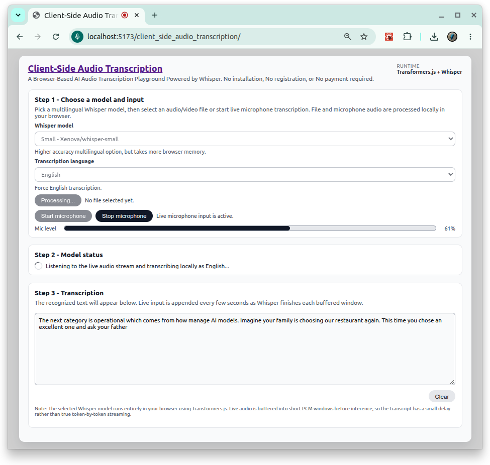

# [क्लाइंट-साइड ऑडियो ट्रांसक्रिप्शन](https://github.com/europanite/client_side_audio_transcription "Client-Side Audio Transcription")

[](https://opensource.org/licenses/Apache-2.0)

[](https://github.com/europanite/client_side_audio_transcription/actions/workflows/ci.yml)
[](https://github.com/europanite/client_side_audio_transcription/actions/workflows/docker.yml)
[](https://github.com/europanite/client_side_audio_transcription/actions/workflows/pages.yml)


<p align="right">
  <a href="./README.md">🇺🇸 English</a> |
  <a href="./README.hi.md">🇮🇳 हिंदी</a> |
  <a href="./README.ja.md">🇯🇵 日本語</a> |
  <a href="./README.zh-CN.md">🇨🇳 简体中文</a> |
  <a href="./README.es.md">🇪🇸 Español</a> |
  <a href="./README.pt-BR.md">🇧🇷 Português (Brasil)</a> |
  <a href="./README.ko.md">🇰🇷 한국어</a> |
  <a href="./README.de.md">🇩🇪 Deutsch</a> |
  <a href="./README.fr.md">🇫🇷 Français</a>
</p>




 [PlayGround](https://europanite.github.io/client_side_audio_transcription/)


Whisper और Transformers.js द्वारा संचालित, ब्राउज़र-आधारित AI ट्रांसक्रिप्शन प्लेग्राउंड।
किसी इंस्टॉलेशन, रजिस्ट्रेशन या भुगतान की आवश्यकता नहीं है।

---

## 🚀 अवलोकन

यह प्रोजेक्ट React, TypeScript और Vite से बना एक क्लाइंट-साइड ट्रांसक्रिप्शन वेब ऐप है।
यह `@huggingface/transformers` के माध्यम से Whisper को सीधे ब्राउज़र में चलाता है, इसलिए मीडिया फ़ाइलें ट्रांसक्रिप्शन के लिए किसी बैकएंड पर अपलोड होने के बजाय स्थानीय रूप से प्रोसेस होती हैं।

मौजूदा कार्यान्वयन UI में Whisper मॉडल चुनने, स्थानीय मीडिया फ़ाइल चुनने, चयनित मॉडल को जरूरत पड़ने पर लोड करने और पहचाने गए टेक्स्ट को read-only transcript क्षेत्र में दिखाने का समर्थन करता है।

## ✨ विशेषताएँ

- **क्लाइंट-साइड speech-to-text**  
  React ऐप ब्राउज़र में सीधे `@huggingface/transformers` की `automatic-speech-recognition` pipeline को कॉल करता है, इसलिए ट्रांसक्रिप्शन पूरी तरह क्लाइंट पर चलता है।

- **सरल 3-चरण workflow**  
  UI आपको इन चरणों से गुजारता है:
  1. Whisper मॉडल लोड करना।
  2. मॉडल status जांचना।
  3. ऑडियो अपलोड करके ट्रांसक्रिप्शन चलाना, हर चरण के लिए स्पष्ट status messages के साथ।

- `@huggingface/transformers` के साथ **in-browser transcription**
- UI में **multilingual Whisper model selection**
- समर्थित built-in model options:
  - `Xenova/whisper-tiny`
  - `Xenova/whisper-base`
  - `Xenova/whisper-small`

- `AudioContext` के जरिए 16 kHz पर client-side audio decoding
- inference से पहले stereo-to-mono mixing
- लंबे media के लिए chunked transcription settings:
  - `chunk_length_s: 20`
  - `stride_length_s: 5`

- File input स्वीकार करता है:
  - `audio/*`
  - `video/mp4`
  - `video/webm`
  - `video/ogg`
  - `.mp4`
  - `.webm`
  - `.ogv`
  - `.m4v`

---

## 🧱 टेक stack

- Frontend: React + TypeScript + Vite
- ML runtime: `@huggingface/transformers`
- Inference task: `automatic-speech-recognition`
- Browser audio handling: Web Audio API (`AudioContext`)
- Testing: Jest + Testing Library
- Container tooling: Docker + Docker Compose

---


## यह कैसे काम करता है

### 1. App layout

`App.tsx` app shell, title, subtitle, `SettingsBar`, और `HomeScreen` को render करता है।

Settings bar अभी runtime summary दिखाता है:

- `Transformers.js + Whisper`

### 2. Model और file selection

`HomeScreen.tsx` 3-step UI देता है:

1. मॉडल और media file चुनें
2. मॉडल status जांचें
3. transcription result पढ़ें

Screen में शामिल है:

- Whisper model dropdown
- button से trigger होने वाला hidden file input
- processing के दौरान status text और spinner
- transcript textarea
- Clear button

### 3. Transcription hook

`useTranscription.ts` core implementation है।

यह expose करता है:

- `status`
- `error`
- `transcript`
- `availableModels`
- `selectedModelId`
- `setSelectedModelId(modelId)`
- `transcribeFile(file)`
- `reset()`

Behavior:

- चयनित Whisper model पहली बार उपयोग पर lazily load होता है
- अगर वही model चयनित रहता है तो pipeline instance cache होकर reuse होता है
- model loading से पहले browser-friendly ONNX WASM settings लागू होती हैं
- चयनित file को `ArrayBuffer` के रूप में पढ़ा जाता है
- Audio को `AudioContext({ sampleRate: 16000 })` से decode किया जाता है
- Multi-channel audio को mono में mix down किया जाता है
- `language` जानबूझकर unset रखा गया है, इसलिए Whisper automatic language detection के साथ चलता है
- पहचाना गया text transcript state में लिखा जाता है

### 4. Status messages

मौजूदा UI user-facing states दिखाता है, जैसे:

- idle: model और file चुनें
- loading: first model load धीमा हो सकता है
- ready: model loaded और ready है
- transcribing: local browser transcription चल रहा है
- done: transcription finished
- error: failure message status block के नीचे दिखता है

## Supported media notes

UI text कहता है कि users audio या video files चुन सकते हैं और Whisper ब्राउज़र में MP3 या MP4 जैसे supported media से speech detect कर सकता है।

हालांकि, वास्तविक implementation selected file को `AudioContext.decodeAudioData()` से decode करता है। व्यवहार में, सफल decoding browser codec support पर निर्भर करती है। इसका मतलब है कि supported behavior आखिरकार इस बात से सीमित होता है कि user का browser selected media file को decode कर सकता है या नहीं।

---

## 🚀 Getting Started

## Local development

### Prerequisites

- Node.js 20+ recommended
- npm

### npm के साथ locally run करें

```bash
cd frontend/app
npm ci
npm run dev -- --host 0.0.0.0 --port 5173
```

### Docker Compose के साथ locally run करें

```bash
docker compose build
docker compose up
```

यह frontend container शुरू करता है और Vite app को port `5173` पर serve करता है।

## Testing

### Tests locally run करें

```bash
cd frontend/app
npm ci
npm test -- --ci --runInBand --coverage --verbose
```

## docker compose development

### Prerequisites
- [Docker Compose](https://docs.docker.com/compose/)

### सभी services build और start करें:

```bash

# Build the image
docker compose build

# Run the container
docker compose up

```

### Test:
```bash
docker compose \
-f docker-compose.test.yml up \
--build --exit-code-from \
frontend_test
```

## Notes and limitations

- Model loading browser में होता है और first use पर समय ले सकता है
- बड़े models अधिक memory इस्तेमाल करते हैं
- Transcription speed browser और device पर निर्भर करती है
- Media decoding support browser codec support पर निर्भर करता है
- मौजूदा app में backend transcription service नहीं है; transcription client-side किया जाता है

---

# License
- Apache License 2.0
