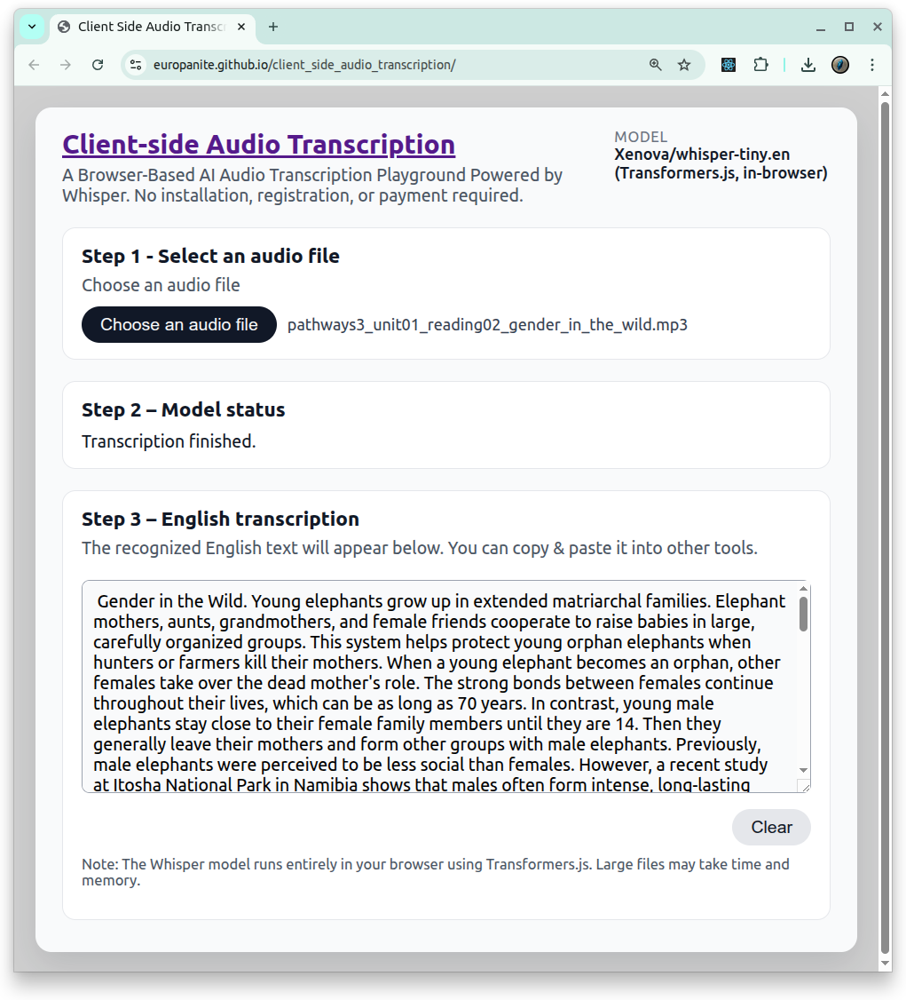

# [Client-Side Audio Transcription](https://github.com/europanite/client_side_audio_transcription "Client-Side Audio Transcription")

[](https://github.com/europanite/client_side_audio_transcription/actions/workflows/docker.yml)
[](https://github.com/europanite/client_side_audio_transcription/actions/workflows/pages.yml)



 [PlayGround](https://europanite.github.io/client_side_audio_transcription/)

A Browser-Based AI Audio Transcription Playground Powered by Whisper.
No installation, registration, or payment required.

---

## 🚀 Overview

This browser-based tool takes an `.mp3` (or `.wav`) file and returns an **Transcription** using [Transformers.js](https://github.com/xenova/transformers.js) and the Whisper **tiny.en** model.  
All speech-to-text runs **inside your browser** – no backend server and no audio leaves your machine.

## ✨ Features

- **Client-side speech-to-text**  
  The React app calls the `automatic-speech-recognition` pipeline from `@huggingface/transformers` directly in the browser, so transcription runs entirely on the client.

- **Simple 3-step workflow**  
  The UI guides you through:
  1. Loading the Whisper model.
  2. Checking model status.
  3. Uploading audio and running transcription, with clear status messages for each step.

- **MP3 / WAV support**  
  Drag & drop or select an `.mp3` (or `.wav`) file. Short, speech-focused clips work best for this demo.

- **Whisper tiny**  
  Uses Xenova's `whisper-tiny.en` model via ONNX in Transformers.js, optimized for speech and small enough to load comfortably in the browser.

- **Modern tooling**  
  Built with React, TypeScript, and Vite, tested with Jest, containerized with Docker, and wired to GitHub Actions for CI, Docker-based tests, and GitHub Pages deployment.

---

## 🧱 Tech stack

- **Frontend**: React + TypeScript + Vite 7 (SPA)
- **ML runtime**: `@huggingface/transformers` (Transformers.js, ONNX backend, Whisper tiny.en)
- **Testing**: Jest + Testing Library (`jsdom` environment)
- **Tooling / CI**:
  - Docker & `docker-compose` for deterministic dev/test environments
  - GitHub Actions:

---


## 🧰 How the transcription flow works

At a high level:

1. **UI layer – `App.tsx` & `HomeScreen.tsx`**  
   - `App.tsx` renders the header, GitHub link, and a short description (“Drop an mp3 file, run Whisper in your browser, and read the transcript.”), plus the `SettingsBar` and `HomeScreen`.  
   - `HomeScreen` implements a simple form:
     - Step 1: A button to load the model.
     - Step 2: A model status panel (idle / loading / ready / error).
     - Step 3: An audio file input (`.mp3` / `.wav`), a “Transcribe” button, and a textarea to display the transcript.

2. **Transcription hook – `useTranscription.ts`**  
   - Exposes `status`, `error`, `transcript`, `transcribeFile(file)`, and `reset()`.
   - Lazily loads the ASR pipeline on first use:
     - Configures `env.allowRemoteModels = true` and a lightweight WASM backend for browsers.
     - Instantiates a cached `automatic-speech-recognition` pipeline using `Xenova/whisper-tiny.en`.
   - When you call `transcribeFile(file)`, it:
     - Ensures the model is loaded.
     - Sets status to `"transcribing"`.
     - Passes the `File` object to the pipeline and waits for the transcription result.
     - Stores the resulting text in `transcript` and updates the status to `"done"` or `"error"`.

3. **Settings bar – `SettingsBar.tsx` & utilities**  
   - Displays the currently used model (`Xenova/whisper-tiny.en (Transformers.js, in-browser)`) and can be extended later with additional settings (e.g., language, model size, chunk length).
   - `HomeScreenUtil.tsx` keeps the GitHub repo and GitHub Pages URLs in one place so you can reuse them in the UI.

4. **Optional auth context – `Auth.tsx`**  
   - Provides an `AuthProvider` with `login`, `logout`, and `authHeader()` helper.
   - Currently not required for basic transcription, but useful if you later add authenticated APIs.

---

## ⚠️ Notes & limitations

- Long audio files will be slower to process in the browser and may hit memory limits on low-end devices.
- A modern desktop browser with WebAssembly support (e.g., recent Chrome / Edge / Firefox) is recommended.

---

## 🚀 Getting Started

### 1. Prerequisites
- [Docker Compose](https://docs.docker.com/compose/)

### 2. Build and start all services:

```bash

# Build the image
docker compose build

# Run the container
docker compose up

```

### 3. Test:
```bash
docker compose \
-f docker-compose.test.yml up \
--build --exit-code-from \
frontend_test
```

---

# License
- Apache License 2.0